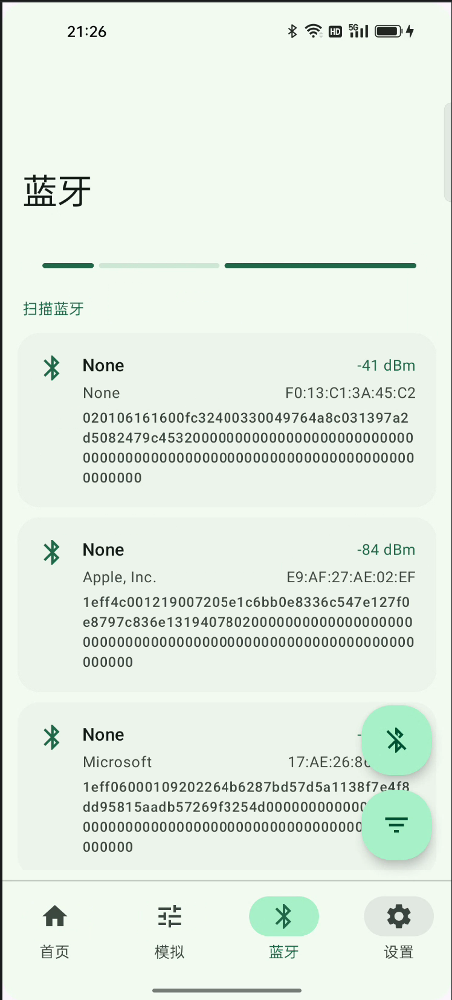
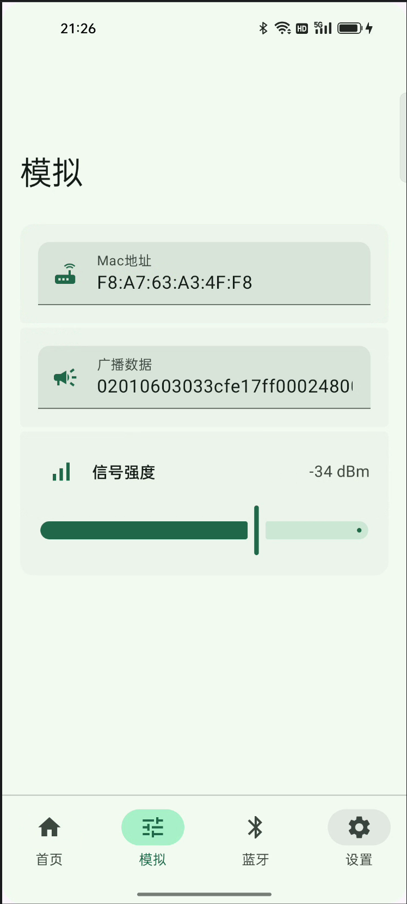
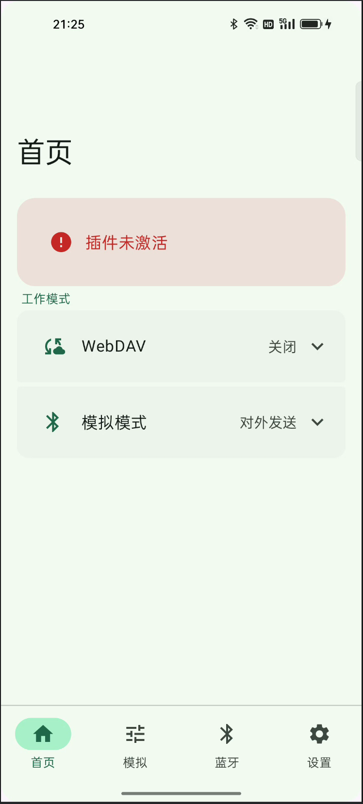
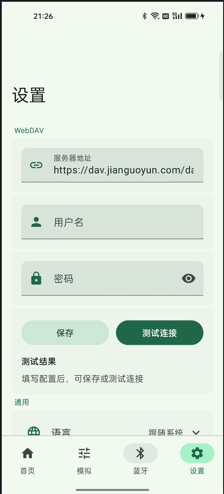
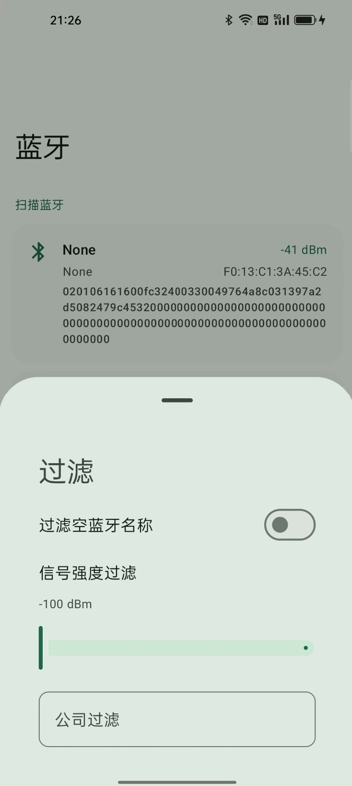
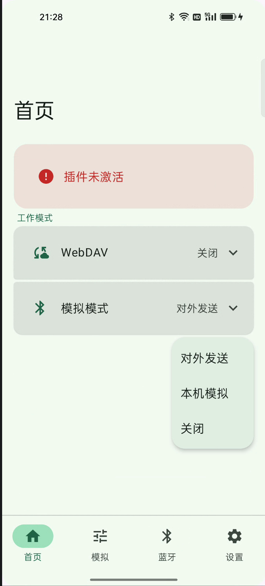
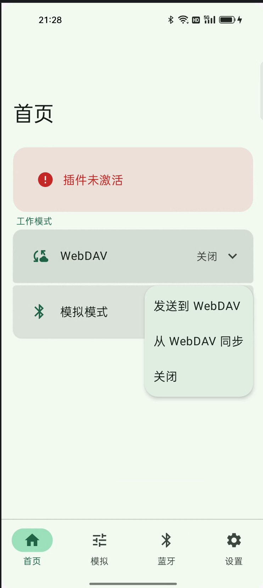

<p align="center">
  
</p>

*Read this in other languages: English, [简体中文](README.zh_CN.md).*

## Introduction

**BluetoothDebug** is an Android tool for debugging Bluetooth Low Energy (BLE). It helps you discover nearby devices, inspect manufacturer data and advertising payloads, simulate BLE behavior, and sync configuration over WebDAV.

## Important notice

> **Do not use this project for attendance or check-in purposes.**
>
> Some check-in apps silently upload location data in the background. If you get caught because of that, it has **nothing to do with this project**.

## Features

| Area | What it does |
| --- | --- |
| **Scan** | Live BLE scan with company-name lookup, RSSI display, and filters (company keyword, empty name, signal strength) |
| **Simulate → Local device** | Injects fake scan results into the system Bluetooth stack via LSPosed (`com.android.bluetooth` / `GattService`) |
| **Simulate → External broadcast** | Runs a foreground BLE advertiser using MAC, advertising data, and RSSI from the Simulate tab |
| **WebDAV → Send** | Periodically scans with the **same filters as the Scan tab**, then uploads the first matching device |
| **WebDAV → Sync** | Pulls remote Bluetooth data into local preferences on a schedule |
| **Settings** | WebDAV credentials, theme, language, optional Hook debug logs |

## Requirements

- Android 12+ (API 30+)
- Bluetooth LE hardware
- **[LSPosed](https://github.com/LSPosed/LSPosed)** with **API 93+** (required for **Local device** simulation)
- Location / Bluetooth runtime permissions (requested by the app when needed)

## LSPosed setup

1. Install the latest APK from [Releases](https://github.com/AnkioTomas/bluetooth/releases).
2. Enable the module in LSPosed.
3. Set scope to:
   - `com.android.bluetooth` (system Bluetooth process — required for local simulation)
   - `net.ankio.bluetooth` (this app)
4. Restart the Bluetooth stack (toggle Bluetooth or reboot) after installing or updating the module.

> **External broadcast** and **WebDAV** modes do not require the Xposed hook. **Local device** simulation does.

## Usage

### 1. Capture a device from scan

1. Open the **Bluetooth** tab and grant scan permissions.
2. Optionally open **Filter** to set company keyword, RSSI threshold, or hide unnamed devices.
3. Tap a scan result — MAC, advertising data, and RSSI are saved to the **Simulate** tab.

### 2. Local device simulation (Xposed)

1. On **Simulate**, review or edit MAC, broadcast data, and RSSI.
2. On **Home**, set **Simulation** to **Local device**.
3. Other apps that scan BLE on this phone will see the configured device.

Enable **Hook debug logs** in **Settings** if you need Xposed-side troubleshooting logs.

### 3. External broadcast (no Xposed)

1. Configure MAC, data, and RSSI on **Simulate**.
2. On **Home**, set **Simulation** to **External broadcast**.
3. The app starts a foreground BLE advertiser. Nearby phones can discover the simulated device.

Advertising stops automatically after 10 minutes, or when you turn the mode off.

### 4. WebDAV sync

Configure WebDAV under **Settings** first.

#### Send to WebDAV (sender)

1. Set scan filters on the **Bluetooth** tab (same rules used for periodic upload).
2. On **Home**, set **WebDAV** to **Send to WebDAV**.
3. A foreground service scans every 5 minutes and uploads the first device that matches your filters.

#### Sync from WebDAV (receiver)

1. On **Home**, set **WebDAV** to **Sync from WebDAV**.
2. A foreground service pulls remote data into local preferences every 5 minutes.

## Build

```bash
./gradlew :app:assembleDebug
```

Release builds are signed separately; install the APK from GitHub Releases for normal use.

## Contribute

Contributions are welcome.

1. Fork the project
2. Create a feature branch (`git checkout -b feature/my-change`)
3. Commit your changes (`git commit -m 'feat: describe your change'`)
4. Push to the branch (`git push origin feature/my-change`)
5. Open a Pull Request

Commit message format:

```
[Type]: [Description]

feat:     New feature
fix:      Bug fix
docs:     Documentation
style:    Formatting only
refactor: Code refactor
perf:     Performance
test:     Tests
chore:    Tooling / misc
deps:     Dependency updates
```

## Screenshots

| | | |
| --- | --- | --- |
|  |  |  |
|  |  | |
|  |  | |

## License

GPL-3.0
